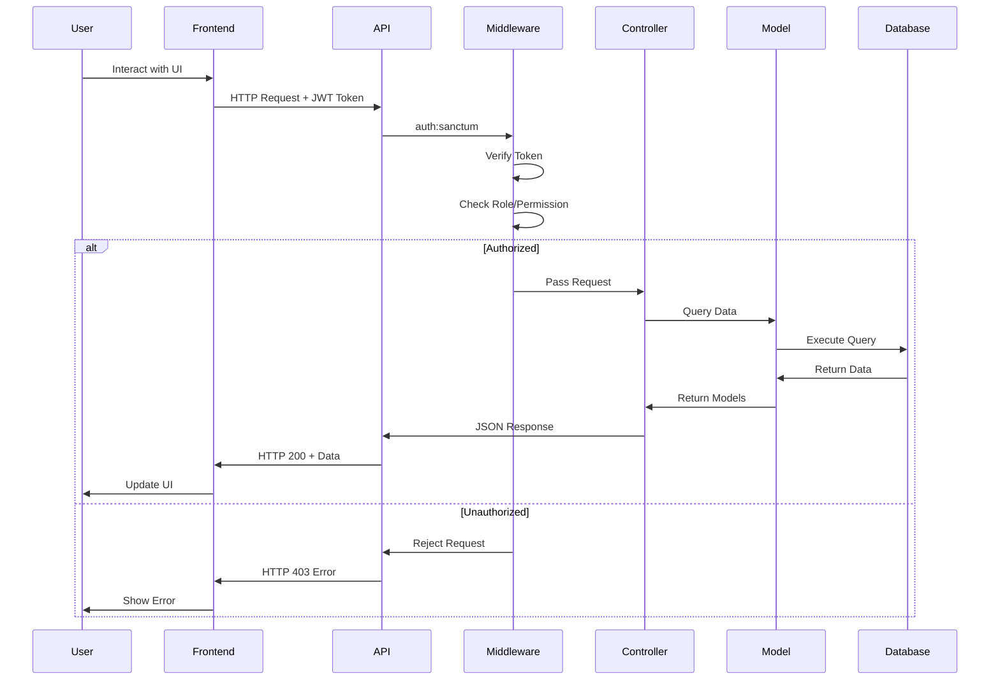
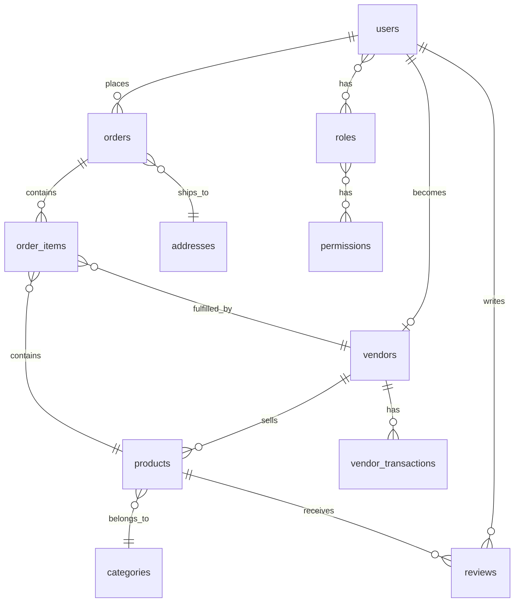

# Nursery App - Complete Project Documentation
**Version:** 1.0
**Last Updated:** December 11, 2025
**Project Type:** E-Commerce Web Application (Nursery/Plant Store)

---

## Table of Contents
1. [Project Overview](#project-overview)
2. [System Architecture](#system-architecture)
3. [Technology Stack](#technology-stack)
4. [Role-Based Access Control](#role-based-access-control)
5. [Database Schema](#database-schema)
6. [API Documentation](#api-documentation)
7. [Frontend Architecture](#frontend-architecture)
8. [Security Features](#security-features)
9. [Development Setup](#development-setup)
10. [Deployment Guide](#deployment-guide)
11. [User Guides](#user-guides)
12. [Troubleshooting](#troubleshooting)

---

## Project Overview

### Description
The Nursery App is a full-featured e-commerce platform specialized for selling plants and gardening products. It supports multiple user roles including customers, vendors, managers, admins, and super admins, each with specific permissions and capabilities.

### Key Features
- **Multi-vendor marketplace** - Multiple vendors can sell products
- **Role-based access control** - 5 roles with 27 granular permissions
- **Product management** - Comprehensive product catalog with categories
- **Order processing** - Complete order workflow with status tracking
- **Vendor management** - Vendor registration, approval, and commission system
- **User management** - Admin tools for managing users and roles
- **Analytics & reporting** - Dashboard with sales analytics
- **Review system** - Product reviews with moderation
- **Vendor wallet** - Payout request and transaction tracking
- **Audit logging** - System activity tracking for compliance

### Project Goals
1. Provide an easy-to-use platform for plant enthusiasts to buy products
2. Enable vendors to manage their own stores independently
3. Give administrators powerful tools for platform management
4. Ensure security through proper role-based access control
5. Scale to support multiple vendors and thousands of products

---

## System Architecture

### High-Level Architecture

```
┌─────────────────────────────────────────────────────────────┐
│                         Frontend Layer                       │
│  (HTML, Alpine.js, Tailwind CSS - Static Files in /. )  │
└───────────────────────┬─────────────────────────────────────┘
                        │ HTTP/JSON
                        │
┌───────────────────────▼─────────────────────────────────────┐
│                     API Layer (Routes)                       │
│           Laravel Routes with Middleware Protection          │
│   ┌──────────┬──────────┬──────────┬──────────┬──────────┐  │
│   │  Public  │  Auth    │  Vendor  │  Admin   │  System  │  │
│   │  Routes  │  Routes  │  Routes  │  Routes  │  Routes  │  │
│   └──────────┴──────────┴──────────┴──────────┴──────────┘  │
└───────────────────────┬─────────────────────────────────────┘
                        │
┌───────────────────────▼─────────────────────────────────────┐
│                   Business Logic Layer                       │
│                   (Controllers & Services)                   │
│   ┌──────────┬──────────┬──────────┬──────────┬──────────┐  │
│   │  Auth    │ Product  │  Order   │  Vendor  │  Admin   │  │
│   │Controller│Controller│Controller│Controller│Controller│  │
│   └──────────┴──────────┴──────────┴──────────┴──────────┘  │
└───────────────────────┬─────────────────────────────────────┘
                        │
┌───────────────────────▼─────────────────────────────────────┐
│                     Data Layer (Models)                      │
│            Eloquent ORM with Relationships                   │
│   ┌──────────┬──────────┬──────────┬──────────┬──────────┐  │
│   │   User   │ Product  │  Order   │  Vendor  │  Review  │  │
│   │  Model   │  Model   │  Model   │  Model   │  Model   │  │
│   └──────────┴──────────┴──────────┴──────────┴──────────┘  │
└───────────────────────┬─────────────────────────────────────┘
                        │
┌───────────────────────▼─────────────────────────────────────┐
│                    Database Layer                            │
│                       MySQL/MariaDB                          │
│   ┌──────────────────────────────────────────────────────┐  │
│   │  Tables: users, products, orders, vendors,           │  │
│   │  roles, permissions, role_has_permissions, etc.      │  │
│   └──────────────────────────────────────────────────────┘  │
└─────────────────────────────────────────────────────────────┘
```

### Request Flow



---

## Technology Stack

### Backend
| Technology | Version | Purpose |
|------------|---------|---------|
| **PHP** | 8.1+ | Server-side language |
| **Laravel** | 10.x | PHP framework |
| **MySQL** | 8.0+ | Relational database |
| **Laravel Sanctum** | 3.x | API authentication |
| **Spatie Laravel-Permission** | 5.10 | Role & permission management |
| **Spatie Laravel-Backup** | 8.x | System backup (optional) |

### Frontend
| Technology | Version | Purpose |
|------------|---------|---------|
| **HTML5** | - | Markup |
| **CSS3** | - | Styling |
| **Tailwind CSS** | 3.x | CSS framework |
| **Alpine.js** | 3.x | Reactive JavaScript framework |
| **Axios** | 1.x | HTTP client |

### Development Tools
| Tool | Purpose |
|------|---------|
| **Composer** | PHP dependency management |
| **NPM** | JavaScript dependency management |
| **Git** | Version control |
| **Artisan** | Laravel CLI tool |

### Server Requirements
- PHP >= 8.1
- MySQL >= 8.0 or MariaDB >= 10.3
- Apache/Nginx web server
- Composer
- PHP Extensions: PDO, mbstring, OpenSSL, JSON, BCMath, Ctype, Fileinfo, XML, Tokenizer

---

## Role-Based Access Control

### Role Hierarchy

```
┌─────────────────────────────────────────────────────────┐
│                     SUPER ADMIN                         │
│  All 27 Permissions + System Management                │
└──────────────────────┬──────────────────────────────────┘
                       │
        ┌──────────────┴──────────────┐
        │                             │
┌───────▼────────┐           ┌────────▼────────┐
│     ADMIN      │           │    MANAGER      │
│  23 Perms      │           │   16 Perms      │
│  No System     │           │   View/Update   │
└───────┬────────┘           └────────┬────────┘
        │                             │
        └──────────────┬──────────────┘
                       │
        ┌──────────────┴──────────────┐
        │                             │
┌───────▼────────┐           ┌────────▼────────┐
│    VENDOR      │           │   CUSTOMER      │
│  Store Mgmt    │           │   Shopping      │
│  Own Products  │           │   View Only     │
└────────────────┘           └─────────────────┘
```

### Complete Permission List

#### Products Module (5 permissions)
1. `products.view` - View all products
2. `products.create` - Create new products
3. `products.update` - Edit product details
4. `products.delete` - Delete products
5. `products.manage` - Full product management (includes all above)

#### Plants Module (4 permissions)
6. `plants.view` - View plant catalog
7. `plants.create` - Add new plants
8. `plants.update` - Edit plant information
9. `plants.delete` - Remove plants

#### Categories Module (4 permissions)
10. `categories.view` - View categories
11. `categories.create` - Create categories
12. `categories.update` - Edit categories
13. `categories.delete` - Delete categories

#### Orders Module (4 permissions)
14. `orders.view` - View all orders
15. `orders.update` - Update order status
16. `orders.delete` - Delete orders
17. `orders.cancel` - Cancel orders

#### Users Module (5 permissions)
18. `users.view` - View user list
19. `users.create` - Create new users
20. `users.update` - Edit user details
21. `users.delete` - Delete users
22. `users.manage` - Full user management

#### Reviews Module (4 permissions)
23. `reviews.view` - View reviews
24. `reviews.approve` - Approve pending reviews
25. `reviews.delete` - Delete reviews
26. `reviews.manage` - Full review management

#### Analytics Module (2 permissions)
27. `analytics.view` - View analytics dashboard
28. `analytics.export` - Export analytics reports

#### Audit Module (1 permission)
29. `audit.view` - View audit logs (Super Admin only)

#### System Module (2 permissions - Super Admin only)
30. `system.settings` - Manage system settings
31. `system.backup` - Create/restore backups

#### Vendor Module (2 special permissions)
32. `vendor.access` - Access vendor portal
33. `vendor.profile.update` - Update vendor profile

### Role-Permission Matrix

| Permission | Super Admin | Admin | Manager | Vendor | Customer |
|------------|:-----------:|:-----:|:-------:|:------:|:--------:|
| products.view | ✅ | ✅ | ✅ | ✅ (own) | ✅ |
| products.create | ✅ | ✅ | ❌ | ✅ (own) | ❌ |
| products.update | ✅ | ✅ | ✅ | ✅ (own) | ❌ |
| products.delete | ✅ | ✅ | ❌ | ✅ (own) | ❌ |
| products.manage | ✅ | ✅ | ❌ | ❌ | ❌ |
| plants.* | ✅ | ✅ | ✅ (view/update) | ❌ | ✅ (view) |
| categories.* | ✅ | ✅ | ✅ (view/update) | ❌ | ✅ (view) |
| orders.view | ✅ | ✅ | ✅ | ✅ (own) | ✅ (own) |
| orders.update | ✅ | ✅ | ✅ | ✅ (items) | ❌ |
| orders.delete | ✅ | ❌ | ❌ | ❌ | ❌ |
| orders.cancel | ✅ | ✅ | ✅ | ❌ | ❌ |
| users.view | ✅ | ✅ | ❌ | ❌ | ❌ |
| users.create | ✅ | ❌ | ❌ | ❌ | ❌ |
| users.update | ✅ | ✅ | ❌ | ❌ | ❌ |
| users.delete | ✅ | ❌ | ❌ | ❌ | ❌ |
| users.manage | ✅ | ✅ | ❌ | ❌ | ❌ |
| reviews.view | ✅ | ✅ | ✅ | ❌ | ✅ |
| reviews.approve | ✅ | ✅ | ✅ | ❌ | ❌ |
| reviews.delete | ✅ | ✅ | ❌ | ❌ | ❌ |
| reviews.manage | ✅ | ✅ | ❌ | ❌ | ❌ |
| analytics.view | ✅ | ✅ | ✅ | ✅ (own) | ❌ |
| analytics.export | ✅ | ✅ | ❌ | ❌ | ❌ |
| audit.view | ✅ | ❌ | ❌ | ❌ | ❌ |
| system.settings | ✅ | ❌ | ❌ | ❌ | ❌ |
| system.backup | ✅ | ❌ | ❌ | ❌ | ❌ |
| vendor.access | ✅ | ❌ | ❌ | ✅ | ❌ |
| vendor.profile.update | ✅ | ❌ | ❌ | ✅ | ❌ |

---

## Database Schema

### Core Tables

#### users
Primary table for all user accounts.

```sql
CREATE TABLE users (
    id BIGINT UNSIGNED AUTO_INCREMENT PRIMARY KEY,
    name VARCHAR(255) NOT NULL,
    email VARCHAR(255) UNIQUE NOT NULL,
    email_verified_at TIMESTAMP NULL,
    password VARCHAR(255) NOT NULL,
    phone VARCHAR(20) NULL,
    role VARCHAR(50) DEFAULT 'customer', -- Legacy field, use Spatie roles
    remember_token VARCHAR(100) NULL,
    created_at TIMESTAMP NULL,
    updated_at TIMESTAMP NULL
);
```

**Relationships:**
- Has many: orders, reviews, addresses
- Has one: vendor
- Belongs to many: roles (via Spatie)

#### vendors
Vendor store information.

```sql
CREATE TABLE vendors (
    id BIGINT UNSIGNED AUTO_INCREMENT PRIMARY KEY,
    user_id BIGINT UNSIGNED NOT NULL UNIQUE,
    store_name VARCHAR(255) UNIQUE NOT NULL,
    store_slug VARCHAR(255) UNIQUE NOT NULL,
    description TEXT NOT NULL,
    logo_path VARCHAR(255) NULL,
    banner_path VARCHAR(255) NULL,
    status ENUM('pending', 'approved', 'suspended', 'rejected') DEFAULT 'pending',
    commission_rate DECIMAL(5,2) DEFAULT 15.00,
    approved_at TIMESTAMP NULL,
    rejected_at TIMESTAMP NULL,
    created_at TIMESTAMP NULL,
    updated_at TIMESTAMP NULL,

    FOREIGN KEY (user_id) REFERENCES users(id) ON DELETE CASCADE
);
```

**Relationships:**
- Belongs to: user
- Has many: products, vendor_transactions

#### products
Product catalog.

```sql
CREATE TABLE products (
    id BIGINT UNSIGNED AUTO_INCREMENT PRIMARY KEY,
    name VARCHAR(255) NOT NULL,
    slug VARCHAR(255) UNIQUE NOT NULL,
    description TEXT NULL,
    price DECIMAL(10,2) NOT NULL,
    compare_price DECIMAL(10,2) NULL,
    stock_quantity INT DEFAULT 0,
    sku VARCHAR(100) UNIQUE NULL,
    category_id BIGINT UNSIGNED NULL,
    vendor_id BIGINT UNSIGNED NULL,
    is_featured BOOLEAN DEFAULT FALSE,
    status ENUM('active', 'inactive', 'out_of_stock') DEFAULT 'active',
    image_path VARCHAR(255) NULL,
    created_at TIMESTAMP NULL,
    updated_at TIMESTAMP NULL,

    FOREIGN KEY (category_id) REFERENCES categories(id) ON DELETE SET NULL,
    FOREIGN KEY (vendor_id) REFERENCES vendors(id) ON DELETE CASCADE
);
```

**Relationships:**
- Belongs to: category, vendor
- Has many: order_items, reviews, product_images

#### orders
Customer orders.

```sql
CREATE TABLE orders (
    id BIGINT UNSIGNED AUTO_INCREMENT PRIMARY KEY,
    user_id BIGINT UNSIGNED NOT NULL,
    order_number VARCHAR(50) UNIQUE NOT NULL,
    status ENUM('pending', 'processing', 'shipped', 'delivered', 'cancelled') DEFAULT 'pending',
    subtotal DECIMAL(10,2) NOT NULL,
    tax DECIMAL(10,2) DEFAULT 0,
    shipping_cost DECIMAL(10,2) DEFAULT 0,
    discount DECIMAL(10,2) DEFAULT 0,
    total DECIMAL(10,2) NOT NULL,
    payment_method VARCHAR(50) NULL,
    payment_status ENUM('pending', 'paid', 'failed', 'refunded') DEFAULT 'pending',
    shipping_address_id BIGINT UNSIGNED NULL,
    notes TEXT NULL,
    created_at TIMESTAMP NULL,
    updated_at TIMESTAMP NULL,

    FOREIGN KEY (user_id) REFERENCES users(id) ON DELETE CASCADE,
    FOREIGN KEY (shipping_address_id) REFERENCES addresses(id) ON DELETE SET NULL
);
```

**Relationships:**
- Belongs to: user, address (shipping)
- Has many: order_items

#### order_items
Individual items in orders.

```sql
CREATE TABLE order_items (
    id BIGINT UNSIGNED AUTO_INCREMENT PRIMARY KEY,
    order_id BIGINT UNSIGNED NOT NULL,
    product_id BIGINT UNSIGNED NOT NULL,
    vendor_id BIGINT UNSIGNED NULL,
    quantity INT NOT NULL,
    price DECIMAL(10,2) NOT NULL,
    subtotal DECIMAL(10,2) NOT NULL,
    status ENUM('pending', 'processing', 'shipped', 'delivered', 'cancelled') DEFAULT 'pending',
    created_at TIMESTAMP NULL,
    updated_at TIMESTAMP NULL,

    FOREIGN KEY (order_id) REFERENCES orders(id) ON DELETE CASCADE,
    FOREIGN KEY (product_id) REFERENCES products(id) ON DELETE CASCADE,
    FOREIGN KEY (vendor_id) REFERENCES vendors(id) ON DELETE SET NULL
);
```

**Relationships:**
- Belongs to: order, product, vendor

#### vendor_transactions
Financial transactions for vendors.

```sql
CREATE TABLE vendor_transactions (
    id BIGINT UNSIGNED AUTO_INCREMENT PRIMARY KEY,
    vendor_id BIGINT UNSIGNED NOT NULL,
    order_id BIGINT UNSIGNED NULL,
    amount DECIMAL(10,2) NOT NULL,
    type ENUM('sale', 'payout', 'refund', 'adjustment') NOT NULL,
    description TEXT NULL,
    status ENUM('pending', 'completed', 'failed') DEFAULT 'pending',
    created_at TIMESTAMP NULL,
    updated_at TIMESTAMP NULL,

    FOREIGN KEY (vendor_id) REFERENCES vendors(id) ON DELETE CASCADE,
    FOREIGN KEY (order_id) REFERENCES orders(id) ON DELETE SET NULL
);
```

**Relationships:**
- Belongs to: vendor, order (optional)

### Spatie Permission Tables

#### roles
```sql
CREATE TABLE roles (
    id BIGINT UNSIGNED AUTO_INCREMENT PRIMARY KEY,
    name VARCHAR(255) NOT NULL,
    guard_name VARCHAR(255) NOT NULL DEFAULT 'web',
    created_at TIMESTAMP NULL,
    updated_at TIMESTAMP NULL,

    UNIQUE KEY (name, guard_name)
);
```

#### permissions
```sql
CREATE TABLE permissions (
    id BIGINT UNSIGNED AUTO_INCREMENT PRIMARY KEY,
    name VARCHAR(255) NOT NULL,
    guard_name VARCHAR(255) NOT NULL DEFAULT 'web',
    created_at TIMESTAMP NULL,
    updated_at TIMESTAMP NULL,

    UNIQUE KEY (name, guard_name)
);
```

#### role_has_permissions
```sql
CREATE TABLE role_has_permissions (
    permission_id BIGINT UNSIGNED NOT NULL,
    role_id BIGINT UNSIGNED NOT NULL,

    PRIMARY KEY (permission_id, role_id),
    FOREIGN KEY (permission_id) REFERENCES permissions(id) ON DELETE CASCADE,
    FOREIGN KEY (role_id) REFERENCES roles(id) ON DELETE CASCADE
);
```

#### model_has_roles
```sql
CREATE TABLE model_has_roles (
    role_id BIGINT UNSIGNED NOT NULL,
    model_type VARCHAR(255) NOT NULL,
    model_id BIGINT UNSIGNED NOT NULL,

    PRIMARY KEY (role_id, model_id, model_type),
    FOREIGN KEY (role_id) REFERENCES roles(id) ON DELETE CASCADE,
    INDEX (model_id, model_type)
);
```

#### model_has_permissions
```sql
CREATE TABLE model_has_permissions (
    permission_id BIGINT UNSIGNED NOT NULL,
    model_type VARCHAR(255) NOT NULL,
    model_id BIGINT UNSIGNED NOT NULL,

    PRIMARY KEY (permission_id, model_id, model_type),
    FOREIGN KEY (permission_id) REFERENCES permissions(id) ON DELETE CASCADE,
    INDEX (model_id, model_type)
);
```

### Entity Relationship Diagram



---

## API Documentation

### Authentication Endpoints

#### POST /api/auth/register
Register a new user account.

**Request:**
```json
{
    "name": "John Doe",
    "email": "john@example.com",
    "password": "password123",
    "password_confirmation": "password123",
    "phone": "+1234567890"
}
```

**Response (201 Created):**
```json
{
    "message": "Registration successful",
    "user": {
        "id": 1,
        "name": "John Doe",
        "email": "john@example.com",
        "role": "customer",
        "roles": [
            {
                "name": "customer"
            }
        ]
    },
    "token": "1|abc123def456..."
}
```

---

#### POST /api/auth/login
Authenticate user and get access token.

**Request:**
```json
{
    "email": "john@example.com",
    "password": "password123"
}
```

**Response (200 OK):**
```json
{
    "message": "Login successful",
    "user": {
        "id": 1,
        "name": "John Doe",
        "email": "john@example.com",
        "role": "customer",
        "roles": [
            {
                "name": "customer",
                "permissions": [...]
            }
        ],
        "vendor": null
    },
    "token": "1|abc123def456..."
}
```

**Error Response (401 Unauthorized):**
```json
{
    "message": "Invalid credentials"
}
```

---

#### POST /api/auth/logout
Revoke current access token.

**Headers:**
```
Authorization: Bearer {token}
```

**Response (200 OK):**
```json
{
    "message": "Logged out successfully"
}
```

---

### Public Product Endpoints

#### GET /api/products
Get paginated list of products.

**Query Parameters:**
- `page` (optional) - Page number (default: 1)
- `per_page` (optional) - Items per page (default: 15)
- `category_id` (optional) - Filter by category
- `search` (optional) - Search by name/description
- `sort` (optional) - Sort field (price, name, created_at)
- `order` (optional) - Sort order (asc, desc)

**Response (200 OK):**
```json
{
    "data": [
        {
            "id": 1,
            "name": "Monstera Deliciosa",
            "slug": "monstera-deliciosa",
            "description": "Beautiful tropical plant",
            "price": 29.99,
            "compare_price": 39.99,
            "stock_quantity": 50,
            "is_featured": true,
            "status": "active",
            "image_path": "/storage/products/monstera.jpg",
            "category": {
                "id": 1,
                "name": "Indoor Plants"
            },
            "vendor": {
                "id": 1,
                "store_name": "Green Thumb Store"
            }
        }
    ],
    "current_page": 1,
    "last_page": 5,
    "per_page": 15,
    "total": 67
}
```

---

#### GET /api/products/{id}
Get single product details.

**Response (200 OK):**
```json
{
    "id": 1,
    "name": "Monstera Deliciosa",
    "slug": "monstera-deliciosa",
    "description": "Beautiful tropical plant with large leaves",
    "price": 29.99,
    "compare_price": 39.99,
    "stock_quantity": 50,
    "sku": "PLANT-MONS-001",
    "is_featured": true,
    "status": "active",
    "image_path": "/storage/products/monstera.jpg",
    "category": {
        "id": 1,
        "name": "Indoor Plants",
        "slug": "indoor-plants"
    },
    "vendor": {
        "id": 1,
        "store_name": "Green Thumb Store",
        "store_slug": "green-thumb-store"
    },
    "images": [
        {
            "id": 1,
            "path": "/storage/products/monstera-1.jpg"
        },
        {
            "id": 2,
            "path": "/storage/products/monstera-2.jpg"
        }
    ],
    "average_rating": 4.5,
    "review_count": 23
}
```

---

### Vendor Endpoints

All vendor endpoints require authentication and vendor role.

**Headers Required:**
```
Authorization: Bearer {token}
```

---

#### POST /api/vendor/register
Register authenticated user as vendor.

**Permission:** Any authenticated user (not vendor)

**Request:**
```json
{
    "store_name": "Green Thumb Store",
    "description": "We specialize in rare tropical plants",
    "logo": "(file upload)",
    "banner": "(file upload)"
}
```

**Response (201 Created):**
```json
{
    "message": "Vendor registration submitted. Awaiting admin approval.",
    "vendor": {
        "id": 1,
        "user_id": 5,
        "store_name": "Green Thumb Store",
        "store_slug": "green-thumb-store",
        "status": "pending",
        "commission_rate": 15.00
    },
    "status": "pending"
}
```

---

#### GET /api/vendor/products
Get vendor's own products.

**Permission:** `vendor.access`

**Query Parameters:**
- `page` (optional)
- `per_page` (optional)
- `status` (optional) - Filter by status

**Response (200 OK):**
```json
{
    "data": [
        {
            "id": 1,
            "name": "Monstera Deliciosa",
            "price": 29.99,
            "stock_quantity": 50,
            "status": "active",
            "created_at": "2025-01-15T10:30:00Z"
        }
    ],
    "current_page": 1,
    "total": 25
}
```

---

#### POST /api/vendor/products
Create new product.

**Permission:** `vendor.access`

**Request:**
```json
{
    "name": "Snake Plant",
    "description": "Easy care indoor plant",
    "price": 19.99,
    "compare_price": 24.99,
    "stock_quantity": 30,
    "sku": "PLANT-SNAKE-001",
    "category_id": 1,
    "image": "(file upload)"
}
```

**Response (201 Created):**
```json
{
    "message": "Product created successfully",
    "product": {
        "id": 2,
        "name": "Snake Plant",
        "slug": "snake-plant",
        "price": 19.99,
        "vendor_id": 1,
        "status": "active"
    }
}
```

---

#### GET /api/vendor/orders
Get vendor's orders (items sold by this vendor).

**Permission:** `vendor.access`

**Response (200 OK):**
```json
{
    "data": [
        {
            "order_id": 123,
            "order_number": "ORD-2025-123",
            "customer": {
                "name": "Jane Smith",
                "email": "jane@example.com"
            },
            "items": [
                {
                    "id": 456,
                    "product_name": "Monstera Deliciosa",
                    "quantity": 2,
                    "price": 29.99,
                    "subtotal": 59.98,
                    "status": "pending"
                }
            ],
            "total": 59.98,
            "status": "processing",
            "created_at": "2025-12-10T14:30:00Z"
        }
    ]
}
```

---

#### GET /api/vendor/wallet
Get vendor wallet balance and transactions.

**Permission:** `vendor.access`

**Response (200 OK):**
```json
{
    "balance": 1250.75,
    "pending": 350.00,
    "total_sales": 5000.00,
    "total_payouts": 3399.25,
    "transactions": [
        {
            "id": 1,
            "type": "sale",
            "amount": 29.99,
            "description": "Order #ORD-2025-123",
            "status": "completed",
            "created_at": "2025-12-10T14:30:00Z"
        },
        {
            "id": 2,
            "type": "payout",
            "amount": -500.00,
            "description": "Payout to bank account",
            "status": "completed",
            "created_at": "2025-12-05T10:00:00Z"
        }
    ]
}
```

---

### Admin Endpoints

All admin endpoints require authentication and specific permissions.

---

#### GET /api/admin/analytics/dashboard
Get dashboard statistics.

**Permission:** `analytics.view`

**Response (200 OK):**
```json
{
    "total_orders": 1250,
    "total_revenue": 45000.00,
    "total_products": 450,
    "total_users": 3200,
    "total_vendors": 45,
    "pending_vendors": 5,
    "recent_orders": [...],
    "top_products": [...],
    "revenue_chart": {
        "labels": ["Jan", "Feb", "Mar", ...],
        "data": [5000, 6500, 7200, ...]
    }
}
```

---

#### GET /api/admin/users/vendors
Get list of vendor applications.

**Permission:** `users.manage`

**Query Parameters:**
- `status` (optional) - Filter by status (pending, approved, suspended, rejected)

**Response (200 OK):**
```json
{
    "data": [
        {
            "id": 1,
            "store_name": "Green Thumb Store",
            "user": {
                "id": 5,
                "name": "John Vendor",
                "email": "john@vendor.com"
            },
            "status": "pending",
            "created_at": "2025-12-01T10:00:00Z"
        }
    ]
}
```

---

#### PUT /api/admin/users/vendors/{id}/approve
Approve vendor application.

**Permission:** `users.manage`

**Response (200 OK):**
```json
{
    "message": "Vendor approved successfully",
    "vendor": {
        "id": 1,
        "status": "approved",
        "approved_at": "2025-12-11T15:30:00Z"
    }
}
```

---

#### PUT /api/admin/users/vendors/{id}/reject
Reject vendor application.

**Permission:** `users.manage`

**Response (200 OK):**
```json
{
    "message": "Vendor application rejected",
    "vendor": {
        "id": 1,
        "status": "rejected",
        "rejected_at": "2025-12-11T15:30:00Z"
    }
}
```

---

#### POST /api/roles/{userId}/assign
Assign role to user.

**Permission:** `users.update`

**Request:**
```json
{
    "role": "manager"
}
```

**Response (200 OK):**
```json
{
    "message": "Role assigned successfully",
    "user": {
        "id": 10,
        "name": "Jane Smith",
        "roles": [
            {
                "name": "manager"
            }
        ]
    }
}
```

---

### Error Responses

All API endpoints may return these error responses:

**401 Unauthorized:**
```json
{
    "message": "Unauthenticated"
}
```

**403 Forbidden:**
```json
{
    "message": "Unauthorized. Missing required permission: {permission}"
}
```

**404 Not Found:**
```json
{
    "message": "Resource not found"
}
```

**422 Unprocessable Entity:**
```json
{
    "message": "The given data was invalid.",
    "errors": {
        "email": [
            "The email has already been taken."
        ],
        "price": [
            "The price must be a number."
        ]
    }
}
```

**500 Internal Server Error:**
```json
{
    "message": "Server error occurred",
    "error": "Error details..."
}
```

---

## Frontend Architecture

### File Structure

```
/public
├── index.html                  # Homepage (customer view)
├── login.html                  # Login page
├── register.html               # Registration page
├── products.html               # Product listing
├── product-detail.html         # Single product page
├── cart.html                   # Shopping cart
├── checkout.html               # Checkout process
├── admin-dashboard.html        # Admin panel
├── vendor-dashboard.html       # Vendor panel
├── vendor-pending.html         # Vendor pending approval page
└── assets/
    ├── js/
    │   └── app.js             # Alpine.js components & auth store
    ├── css/
    │   └── styles.css         # Custom styles
    └── images/                # Static images
```

### Alpine.js Architecture

#### Auth Store
Central authentication state management.

```javascript
Alpine.store('auth', {
    user: null,
    token: null,

    init() {
        // Load from localStorage on page load
    },

    async login(email, password) {
        // POST /api/auth/login
    },

    async register(data) {
        // POST /api/auth/register
    },

    logout() {
        // POST /api/auth/logout
        // Clear localStorage
    },

    hasRole(role) {
        // Check if user has role
    },

    hasPermission(permission) {
        // Check if user has permission
    }
});
```

#### Component Pattern

Each dashboard uses Alpine.js component pattern:

```javascript
function adminDashboard() {
    return {
        loading: true,
        authorized: false,
        currentView: 'dashboard',
        products: [],

        init() {
            // Check authorization
            // Load initial data
        },

        async loadProducts() {
            // Fetch products from API
        },

        async createProduct(data) {
            // POST to API
        }
    }
}
```

### UI Components

#### Sidebar Navigation
- Role-based menu items using `x-if` directives
- Active state management
- Permission checks for each menu item

#### Data Tables
- Pagination
- Sorting
- Filtering
- Action buttons with permission checks

#### Forms
- Validation
- Error display
- File uploads
- Loading states

#### Modals
- Create/Edit forms
- Confirmation dialogs
- Detail views

---

## Security Features

### Authentication
- **Laravel Sanctum** - Token-based authentication
- **CSRF Protection** - For web forms
- **Password Hashing** - Bcrypt algorithm
- **Email Verification** - Optional email verification
- **Rate Limiting** - Prevent brute force attacks

### Authorization
- **Role-Based Access Control** - Via Spatie Laravel-Permission
- **Middleware Protection** - All sensitive routes protected
- **Permission Checks** - Granular permission system
- **Frontend Guards** - UI elements hidden based on permissions

### Data Protection
- **SQL Injection Prevention** - Eloquent ORM with prepared statements
- **XSS Protection** - Input sanitization and output escaping
- **Mass Assignment Protection** - Fillable/guarded properties on models
- **File Upload Validation** - Type and size restrictions
- **HTTPS Enforcement** - Recommended for production

### Vendor Isolation
- **Data Scoping** - Vendors only see their own data
- **Product Ownership** - Vendors can only modify own products
- **Order Item Access** - Vendors only see their order items
- **Wallet Privacy** - Each vendor has isolated wallet

### Audit Trail
- **User Actions** - Track important user actions
- **Role Changes** - Log role assignments/removals
- **Permission Changes** - Log permission modifications
- **Vendor Approvals** - Log vendor status changes

---

## Development Setup

### Prerequisites
- PHP 8.1 or higher
- Composer
- MySQL 8.0 or MariaDB 10.3
- Node.js & NPM (for frontend assets)
- Git

### Installation Steps

1. **Clone Repository**
```bash
git clone <repository-url>
cd nursery-app
```

2. **Install PHP Dependencies**
```bash
composer install
```

3. **Install JavaScript Dependencies** (if needed)
```bash
npm install
```

4. **Environment Configuration**
```bash
cp .env.example .env
php artisan key:generate
```

Edit `.env` file:
```env
APP_NAME="Nursery App"
APP_ENV=local
APP_DEBUG=true
APP_URL=http://localhost:8000

DB_CONNECTION=mysql
DB_HOST=127.0.0.1
DB_PORT=3306
DB_DATABASE=nursery_app
DB_USERNAME=root
DB_PASSWORD=

SANCTUM_STATEFUL_DOMAINS=localhost:8000
SESSION_DOMAIN=localhost
```

5. **Create Database**
```bash
# Using MySQL CLI
mysql -u root -p
CREATE DATABASE nursery_app;
EXIT;
```

6. **Run Migrations**
```bash
php artisan migrate
```

7. **Seed Database**
```bash
# Seed roles and permissions
php artisan db:seed --class=RolePermissionSeeder

# Optional: Seed sample data
php artisan db:seed
```

8. **Create Storage Link**
```bash
php artisan storage:link
```

9. **Start Development Server**
```bash
php artisan serve
```

Application will be available at: `http://localhost:8000`

### Creating Test Users

```bash
php artisan tinker
```

```php
// Create Super Admin
$user = \App\Models\User::create([
    'name' => 'Super Admin',
    'email' => 'superadmin@nursery.com',
    'password' => bcrypt('password123'),
]);
$user->assignRole('super_admin');

// Create Admin
$user = \App\Models\User::create([
    'name' => 'Admin User',
    'email' => 'admin@nursery.com',
    'password' => bcrypt('password123'),
]);
$user->assignRole('admin');

// Create Vendor
$user = \App\Models\User::create([
    'name' => 'Test Vendor',
    'email' => 'vendor@nursery.com',
    'password' => bcrypt('password123'),
]);
$vendor = \App\Models\Vendor::create([
    'user_id' => $user->id,
    'store_name' => 'Test Vendor Store',
    'store_slug' => 'test-vendor-store',
    'description' => 'Test vendor description',
    'status' => 'approved',
]);
$user->assignRole('vendor');
```

---

## Deployment Guide

### Production Checklist

- [ ] Update `.env` for production
- [ ] Set `APP_ENV=production`
- [ ] Set `APP_DEBUG=false`
- [ ] Configure proper database credentials
- [ ] Set up SSL certificate (HTTPS)
- [ ] Configure proper file permissions
- [ ] Set up backup strategy
- [ ] Configure queue workers (if using queues)
- [ ] Set up monitoring and logging
- [ ] Run optimization commands

### Environment Configuration

```env
APP_NAME="Nursery App"
APP_ENV=production
APP_DEBUG=false
APP_URL=https://your-domain.com

DB_CONNECTION=mysql
DB_HOST=your-db-host
DB_PORT=3306
DB_DATABASE=your-db-name
DB_USERNAME=your-db-user
DB_PASSWORD=your-db-password

SANCTUM_STATEFUL_DOMAINS=your-domain.com
SESSION_DOMAIN=.your-domain.com
```

### Optimization Commands

```bash
# Cache configuration
php artisan config:cache

# Cache routes
php artisan route:cache

# Cache views
php artisan view:cache

# Optimize autoloader
composer install --optimize-autoloader --no-dev
```

### File Permissions

```bash
# Storage and cache directories
chmod -R 775 storage
chmod -R 775 bootstrap/cache

# Web server user (e.g., www-data)
chown -R www-data:www-data storage
chown -R www-data:www-data bootstrap/cache
```

### Web Server Configuration

#### Apache (.htaccess)
Laravel includes a `.htaccess` file in the public directory.

#### Nginx
```nginx
server {
    listen 80;
    server_name your-domain.com;
    root /var/www/nursery-app/public;

    add_header X-Frame-Options "SAMEORIGIN";
    add_header X-Content-Type-Options "nosniff";

    index index.php;

    charset utf-8;

    location / {
        try_files $uri $uri/ /index.php?$query_string;
    }

    location = /favicon.ico { access_log off; log_not_found off; }
    location = /robots.txt  { access_log off; log_not_found off; }

    error_page 404 /index.php;

    location ~ \.php$ {
        fastcgi_pass unix:/var/run/php/php8.1-fpm.sock;
        fastcgi_param SCRIPT_FILENAME $realpath_root$fastcgi_script_name;
        include fastcgi_params;
    }

    location ~ /\.(?!well-known).* {
        deny all;
    }
}
```

---

## User Guides

### For Customers

#### Registering an Account
1. Go to `/register.html`
2. Fill in name, email, password
3. Click "Register"
4. You'll be automatically logged in as a customer

#### Shopping
1. Browse products on homepage
2. Click product to view details
3. Add to cart
4. Proceed to checkout
5. Enter shipping address
6. Complete payment
7. Track order in "My Orders"

### For Vendors

#### Becoming a Vendor
1. Register/login as customer
2. Go to Vendor Registration
3. Fill in store details (name, description)
4. Upload logo and banner (optional)
5. Submit application
6. Wait for admin approval
7. Once approved, access vendor dashboard

#### Managing Products
1. Login and go to vendor dashboard
2. Click "Products" tab
3. Click "Add Product" to create new
4. Fill in product details (name, price, stock)
5. Upload product images
6. Click "Save"
7. Edit or delete products from product list

#### Processing Orders
1. Go to "Orders" tab in vendor dashboard
2. View orders containing your products
3. Update order item status (shipped, delivered)
4. View customer details for shipping

#### Managing Wallet
1. Go to "Wallet" tab
2. View balance and pending funds
3. View transaction history
4. Request payout when balance available

### For Admins

#### Managing Vendors
1. Login as admin
2. Go to admin dashboard
3. Click "Vendors" in sidebar
4. View pending applications
5. Click "Approve" or "Reject" for each vendor
6. Suspend active vendors if needed

#### Managing Users
1. Go to "Users" section
2. View all users
3. Assign/remove roles
4. Edit user details
5. Suspend/activate accounts

#### Viewing Analytics
1. Go to "Dashboard" section
2. View sales charts
3. View top products
4. Export reports (if admin+)

### For Super Admins

#### System Settings
1. Login as super admin
2. Go to "System Settings" (only visible to super admins)
3. Configure application settings
4. Set vendor commission rate
5. Clear cache if needed
6. Optimize application

#### Creating Backups
1. Go to "System" → "Backups"
2. Click "Create Backup"
3. Select backup type (full, database only)
4. Download backup files
5. Store securely offsite

#### Viewing Audit Logs
1. Go to "Audit Logs"
2. Filter by date, user, action
3. Review system changes
4. Export logs if needed

---

## Troubleshooting

### Common Issues

#### 1. 403 Forbidden on Vendor Routes

**Symptom:** Vendor gets 403 error when accessing `/api/vendor/products`

**Possible Causes:**
- Vendor status is "pending" or "rejected"
- User doesn't have vendor role
- Vendor routes not properly protected

**Solution:**
```bash
# Check vendor status
php artisan tinker
$user = \App\Models\User::find(5);
$user->vendor->status; // Should be "approved"

# Check if user has vendor role
$user->hasRole('vendor'); // Should return true

# If false, assign role
$user->assignRole('vendor');
```

#### 2. Roles Not Working

**Symptom:** Role checks return false even though user has role

**Possible Causes:**
- Spatie package not installed
- Migrations not run
- Roles not seeded

**Solution:**
```bash
# Install package if missing
composer require spatie/laravel-permission

# Run migrations
php artisan migrate

# Seed roles
php artisan db:seed --class=RolePermissionSeeder

# Clear cache
php artisan cache:clear
php artisan config:clear
```

#### 3. Frontend Not Showing Permissions

**Symptom:** UI elements show/hide incorrectly based on permissions

**Possible Causes:**
- Auth store not loading permissions
- AuthController not including relationships
- localStorage out of sync

**Solution:**
1. Update AuthController to load permissions:
```php
$user->load(['roles.permissions', 'permissions']);
```

2. Clear localStorage and re-login:
```javascript
localStorage.clear();
// Then login again
```

#### 4. CORS Errors

**Symptom:** API requests fail with CORS error

**Solution:**
```php
// config/cors.php
'paths' => ['api/*', 'sanctum/csrf-cookie'],
'allowed_origins' => ['http://localhost:8000'],
'supports_credentials' => true,
```

#### 5. File Upload Fails

**Symptom:** Image uploads return error

**Solution:**
```bash
# Check storage directory permissions
chmod -R 775 storage
chown -R www-data:www-data storage

# Create storage link
php artisan storage:link

# Check php.ini limits
upload_max_filesize = 10M
post_max_size = 10M
```

### Debug Commands

```bash
# View all routes
php artisan route:list

# View all roles and permissions
php artisan tinker
\Spatie\Permission\Models\Role::with('permissions')->get();

# Check specific user permissions
$user = \App\Models\User::find(1);
$user->getAllPermissions();
$user->getRoleNames();

# Clear all caches
php artisan cache:clear
php artisan config:clear
php artisan route:clear
php artisan view:clear

# Check database connection
php artisan db:show
php artisan db:table users

# Run migrations from scratch
php artisan migrate:fresh --seed
```

---

## Maintenance

### Regular Tasks

#### Daily
- Monitor error logs
- Check failed jobs queue
- Review vendor applications

#### Weekly
- Review system performance
- Check storage usage
- Backup database

#### Monthly
- Security audit
- Update dependencies
- Review user feedback
- Optimize database

### Backup Strategy

```bash
# Manual backup
php artisan backup:run

# Scheduled backup (add to scheduler)
php artisan schedule:run
```

### Updating Dependencies

```bash
# Check for updates
composer outdated

# Update packages
composer update

# Update specific package
composer update spatie/laravel-permission
```

---

## Support & Resources

### Documentation
- Laravel: https://laravel.com/docs
- Spatie Laravel-Permission: https://spatie.be/docs/laravel-permission
- Laravel Sanctum: https://laravel.com/docs/sanctum
- Alpine.js: https://alpinejs.dev
- Tailwind CSS: https://tailwindcss.com

### Community
- Laravel Forums: https://laracasts.com/discuss
- Stack Overflow: Tag `laravel`
- GitHub Issues: (Project repository)

### Contact
- Developer: [Your contact info]
- Support Email: support@nursery-app.com
- Documentation: (Link to online docs)

---

**End of Project Documentation**
