# Nursery App - Role System Analysis

## Overview

The Nursery App implements a comprehensive Role-Based Access Control (RBAC) system using **Spatie Laravel-Permission** package. The system has **5 distinct roles** with **27 permissions** that control access to various features.

---

## Roles Summary

| # | Role | Description | Access Level |
|---|------|-------------|--------------|
| 1 | **Super Admin** | Full system access, all permissions | 🔴 Highest |
| 2 | **Admin** | Manage products, users, orders, reviews | 🟠 High |
| 3 | **Manager** | Update products/orders, view analytics | 🟡 Medium |
| 4 | **Vendor** | Manage own products and orders | 🔵 Specialized |
| 5 | **Customer** | View products, place orders | 🟢 Basic |

---

## Role Access Flow


---

## Detailed Role Permissions

### 1. Super Admin (Highest Level)

**All permissions** - Complete system control


| Permission | Enabled |
|------------|---------|
| products.view, create, update, delete, manage | ✅ |
| plants.view, create, update, delete | ✅ |
| categories.view, create, update, delete | ✅ |
| orders.view, update, delete, cancel | ✅ |
| users.view, create, update, delete, manage | ✅ |
| reviews.view, approve, delete, manage | ✅ |
| analytics.view, export | ✅ |
| audit.view | ✅ |
| system.settings | ✅ |
| system.backup | ✅ |

---

### 2. Admin

```mermaid
flowchart LR
    AD[Admin Role] --> PM[Product Management]
    AD --> UM[User Management]
    AD --> OM[Order Management]
    AD --> RM[Review Management]
    AD --> AN[Analytics]
    
    PM --> PM1[View ✅]
    PM --> PM2[Create ✅]
    PM --> PM3[Update ✅]
    PM --> PM4[Delete ✅]
    
    UM --> UM1[View ✅]
    UM --> UM2[Update ✅]
    UM --> UM3[Manage ✅]
    UM --> UM4["Create ❌"]
    
    OM --> OM1[View ✅]
    OM --> OM2[Update ✅]
    OM --> OM3[Cancel ✅]
    
    RM --> RM1[All Review Permissions ✅]
    
    AN --> AN1[View ✅]
    AN --> AN2[Export ✅]
```



**Cannot Access:**
- ❌ System settings
- ❌ System backup
- ❌ Audit logs
- ❌ Delete users
- ❌ Delete orders

---

### 3. Manager

```mermaid
flowchart LR
    MG[Manager Role] --> V[View Permissions]
    MG --> U[Update/Process]
    
    V --> V1[Products ✅]
    V --> V2[Plants ✅]
    V --> V3[Categories ✅]
    V --> V4[Orders ✅]
    V --> V5[Reviews ✅]
    V --> V6[Analytics ✅]
    
    U --> U1[Update Products ✅]
    U --> U2[Update Plants ✅]
    U --> U3[Update Categories ✅]
    U --> U4[Update Orders ✅]
    U --> U5[Cancel Orders ✅]
    U --> U6[Approve Reviews ✅]
```



**Cannot Access:**
- ❌ Create/Delete products
- ❌ User management
- ❌ Delete reviews
- ❌ Export analytics
- ❌ Any system features

---

### 4. Vendor (Specialized Role)

```mermaid
flowchart LR
    VN[Vendor Role] --> SP[Store & Products]
    VN --> OR[Orders]
    VN --> WL[Wallet]
    
    SP --> SP1[Create Own Products ✅]
    SP --> SP2[View Own Products ✅]
    SP --> SP3[Update Own Products ✅]
    SP --> SP4[Delete Own Products ✅]
    SP --> SP5[Update Store Profile ✅]
    
    OR --> OR1[View Own Orders ✅]
    OR --> OR2["Update Item Status (Ship) ✅"]
    
    WL --> WL1[View Wallet Balance ✅]
    WL --> WL2[Request Payout ✅]
```



**Special Vendor Permissions:**
- `vendor.access`
- `vendor.profile.update`

**Cannot Access:**
- ❌ Other vendors' products
- ❌ Other vendors' orders
- ❌ Admin dashboard
- ❌ User management
- ❌ Review management

---

### 5. Customer (Basic Role)

```mermaid
flowchart LR
    CU[Customer Role] --> VP[View Public]
    CU --> AC[Account Features]
    CU --> SH[Shopping]
    
    VP --> VP1[View Products ✅]
    VP --> VP2[View Plants ✅]
    VP --> VP3[View Categories ✅]
    VP --> VP4[View Reviews ✅]
    
    AC --> AC1[Manage Profile ✅]
    AC --> AC2[Manage Addresses ✅]
    AC --> AC3[Plant Care Reminders ✅]
    AC --> AC4[Loyalty Points ✅]
    
    SH --> SH1[Cart Management ✅]
    SH --> SH2[Wishlist ✅]
    SH --> SH3[Place Orders ✅]
    SH --> SH4[View Own Orders ✅]
    SH --> SH5[Write Reviews ✅]
```



---

## How to Access Each Role

### Authentication Flow


### Access Methods by Role

| Role | Login URL | Dashboard Access |
|------|-----------|------------------|
| **Customer** | `/login.html` → `/index.html` | Frontend shopping experience |
| **Vendor** | `/login.html` → `/vendor-dashboard.html` | Vendor portal |
| **Manager** | `/login.html` → `/admin-dashboard.html` | Limited admin features |
| **Admin** | `/login.html` → `/admin-dashboard.html` | Full admin dashboard |
| **Super Admin** | `/login.html` → `/admin-dashboard.html` | Full admin + system |

### API Endpoints for Role Assignment

Admin users can assign roles using:

```
POST /api/roles/{userId}/assign
Body: { "role": "manager" }

POST /api/roles/{userId}/remove  
Body: { "role": "manager" }
```

---

## API Route Protection Summary

### Public Routes (No Auth Required)
- `GET /api/products` - Browse products
- `GET /api/categories` - View categories
- `GET /api/reviews` - View reviews
- `GET /api/plant-care-guides` - View guides
- `POST /api/auth/register` - Register
- `POST /api/auth/login` - Login

### Customer Routes (Auth Required)
- `GET/POST /api/cart/*` - Cart management
- `GET/POST /api/orders` - Order management
- `GET/POST /api/wishlist/*` - Wishlist
- `GET/PUT /api/profile` - Profile management
- `GET/POST /api/plant-care-reminders` - Plant care

### Vendor Routes (Vendor Role Required)
- `GET/POST /api/vendor/products` - Product CRUD
- `GET/PUT /api/vendor/orders` - Order management
- `GET /api/vendor/wallet` - Wallet access

### Admin Routes (Permission-Based)

| Route Pattern | Required Permission |
|---------------|---------------------|
| `/api/admin/analytics/*` | `analytics.view` |
| `/api/admin/orders/*` | `orders.update` |
| `/api/admin/products/*` | `products.manage` |
| `/api/admin/reviews/*` | `reviews.manage` |
| `/api/admin/users/*` | `users.manage` |
| `/api/admin/audit-logs/*` | `audit.view` |
| `/api/roles/*` | `users.view` |

---

## Permission Matrix

| Permission | Super Admin | Admin | Manager | Vendor | Customer |
|------------|:-----------:|:-----:|:-------:|:------:|:--------:|
| **Products** |
| products.view | ✅ | ✅ | ✅ | ✅ | ✅ |
| products.create | ✅ | ✅ | ❌ | ✅ | ❌ |
| products.update | ✅ | ✅ | ✅ | ✅ | ❌ |
| products.delete | ✅ | ✅ | ❌ | ✅ | ❌ |
| products.manage | ✅ | ✅ | ❌ | ❌ | ❌ |
| **Orders** |
| orders.view | ✅ | ✅ | ✅ | ✅ | ✅ |
| orders.update | ✅ | ✅ | ✅ | ✅ | ❌ |
| orders.delete | ✅ | ❌ | ❌ | ❌ | ❌ |
| orders.cancel | ✅ | ✅ | ✅ | ❌ | ❌ |
| **Users** |
| users.view | ✅ | ✅ | ❌ | ❌ | ❌ |
| users.create | ✅ | ❌ | ❌ | ❌ | ❌ |
| users.update | ✅ | ✅ | ❌ | ❌ | ❌ |
| users.delete | ✅ | ❌ | ❌ | ❌ | ❌ |
| users.manage | ✅ | ✅ | ❌ | ❌ | ❌ |
| **Reviews** |
| reviews.view | ✅ | ✅ | ✅ | ❌ | ✅ |
| reviews.approve | ✅ | ✅ | ✅ | ❌ | ❌ |
| reviews.delete | ✅ | ✅ | ❌ | ❌ | ❌ |
| reviews.manage | ✅ | ✅ | ❌ | ❌ | ❌ |
| **Analytics** |
| analytics.view | ✅ | ✅ | ✅ | ✅ | ❌ |
| analytics.export | ✅ | ✅ | ❌ | ❌ | ❌ |
| **System** |
| audit.view | ✅ | ❌ | ❌ | ❌ | ❌ |
| system.settings | ✅ | ❌ | ❌ | ❌ | ❌ |
| system.backup | ✅ | ❌ | ❌ | ❌ | ❌ |

---

## Vendor Registration Flow

```mermaid
flowchart TD
    A[User with Customer Role] --> B[POST /api/vendor/register]
    B --> C{Provide Store Details}
    C --> D[Store Name, Description, Logo]
    D --> E[Vendor Profile Created]
    E --> F{Status: Pending}
    
    F --> G[Admin Reviews Application]
    G --> H{Admin Decision}
    
    H -->|Approve| I[PUT /api/admin/users/vendors/{id}/approve]
    I --> J[Status: Approved]
    J --> K[Vendor Gets vendor Role]
    K --> L[Access to Vendor Dashboard]
    
    H -->|Reject| M[PUT /api/admin/users/vendors/{id}/reject]
    M --> N[Status: Rejected]
    N --> O[Remains Customer]
```

---

## Key Files Reference

| File | Purpose |
|------|---------|
| [User.php](file:///Users/sahilakoliya/Work/Collage/MSC-IT/sem-1/nursery-app/app/Models/User.php) | User model with role methods |
| [RolePermissionSeeder.php](file:///Users/sahilakoliya/Work/Collage/MSC-IT/sem-1/nursery-app/database/seeders/RolePermissionSeeder.php) | All roles & permissions definition |
| [EnsurePermission.php](file:///Users/sahilakoliya/Work/Collage/MSC-IT/sem-1/nursery-app/app/Http/Middleware/EnsurePermission.php) | Permission checking middleware |
| [EnsureRole.php](file:///Users/sahilakoliya/Work/Collage/MSC-IT/sem-1/nursery-app/app/Http/Middleware/EnsureRole.php) | Role checking middleware |
| [api.php](file:///Users/sahilakoliya/Work/Collage/MSC-IT/sem-1/nursery-app/routes/api.php) | All API routes with middleware |
| [admin-dashboard.html](file:///Users/sahilakoliya/Work/Collage/MSC-IT/sem-1/nursery-app/public/admin-dashboard.html) | Admin frontend dashboard |

---

## Summary Statistics

- **Total Roles:** 5 (Super Admin, Admin, Manager, Vendor, Customer)
- **Total Permissions:** 27
- **Permission Categories:** 7 (Products, Plants, Categories, Orders, Users, Reviews, Analytics, Audit, System)
- **Middleware Used:** EnsureRole, EnsurePermission, auth:sanctum
- **Package:** Spatie Laravel-Permission

